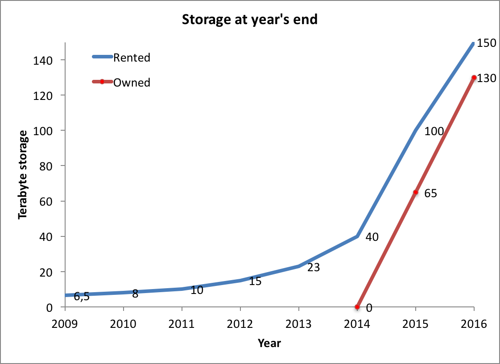
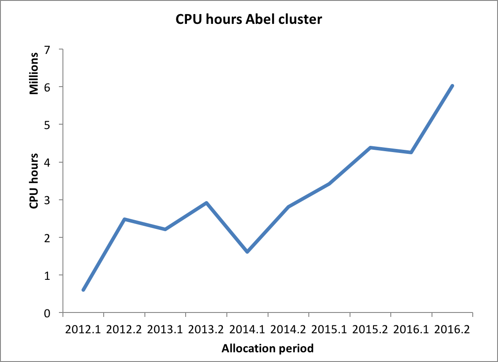
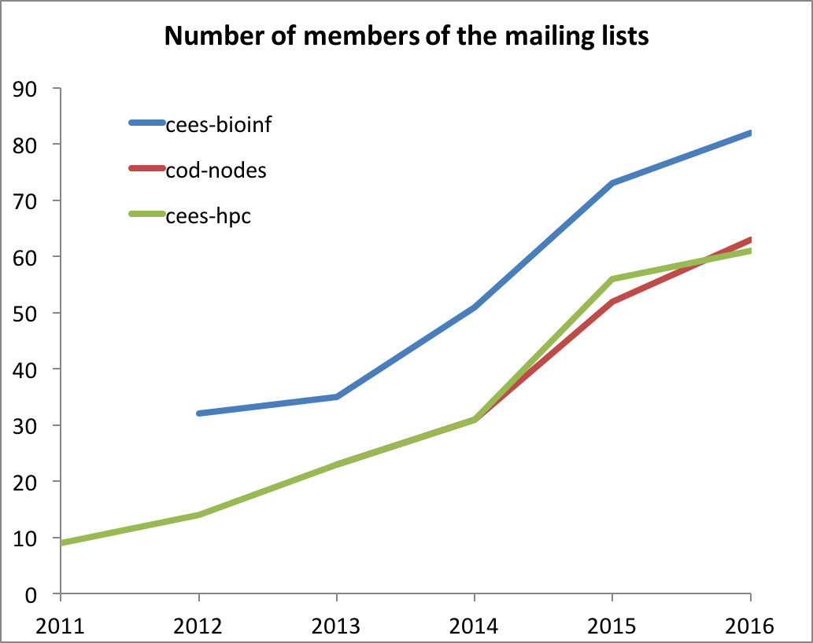

CEES bioinformatics – yearly report for 2016
============================================

  * [Introduction](#introduction)
  * [People](#people)
  * [Infrastructure](#infrastructure)
    * [Strategic considerations](#strategic-considerations)
    * [Hardware](#hardware)
    * [Software](#software)
    * [Administration](#administration)
  * [Projects](#projects)
    * [Genome browser](#genome-browser)
  * [Mailing lists](#mailing-lists)
  * [Wiki](#wiki)
  * [Courses](#courses)
  * [Outlook 2016](#outlook-2016)

## Introduction

Bioinformatics – “an interdisciplinary field that develops and improves
upon methods for storing, retrieving, organizing and analyzing
biological data” (Wikipedia) was still a growing field at CEES in 2016. Ever more
researchers are generating large ‘digital’ datasets
that need to be analyzed using sophisticated bioinformatics tools. We
use bioinformatics in a wide sense here, so that the following types of
researchers are examples of bioinformaticians at CEES:

-   all users of ‘R’
-   those doing statistical modeling
-   those analyzing next generation sequencing data, be it genomics,
    transcriptomics, or other such data
-   those working with time series data
-   those extensively using the unix command-line, programming in perl,
    python, C, etc.

## People

Based on the number of researchers subscribed to the different mailing
lists (see below) we estimate more than 60 CEES members substantially
rely on bioinformatic methods during their research.

## Infrastructure

### Strategic considerations

Many researchers are still able to perform their analysis on their
desktop/laptop machine. However, increasingly, we need to perform tasks
that are either CPU or memory intensive.

At CEES, we use a combination of self-owned servers, and CPU hours we
applied for nationally on the UiO supercomputer ‘Abel’. This maximizes
flexibility for CEES researchers in choosing the right resource for
their project:

-   memory-intensive applications can be run on our own servers
-   CPU-intensive applications can be submitted to Abel and therefore do
    not take up valuable time on our own servers

The servers CEES owns (see below) are physically co-located with, and
attached to, the Abel system. This means users can seamlessly access the
same programs and disks on the self-owned servers, as well as on Abel. The self-owned servers come with a significant amount of dic space. Beyond that, we rent ‘project disk space from USIT at UiO (attached to Abel), rather than buy and administer our own.

The benefit
of this strategy is that we do not have to spend valuable research time
on basic system administrative tasks and software installation. The HPC
(high-performance computing) group of USIT is very proficient in
installing programs with difficult dependencies or requirements.
Finally, backup of valuable research data is arranged for as well.

### Hardware

Starting with the project to sequence and assemble the genome of
Atlantic cod in 2009, CEES has invested in its own hardware for
computation. These servers are hosted and maintained by the HPC group of
USIT. In 2015, using combined funds from the Norwegian Sequencing Centre, the Aqua
Genome project as well as a generous contribution from the Faculty of Mathematics and Natural Sciences, we completely renewed the self-owned servers, which means that from this year, the following computational infrastructure were available to CEES researchers:

-   three high-memory servers with 32 CPUs and 1.5 Terabyte of RAM, and 64 TB local disk space each (‘cod5’, 'cod6', and ‘cod7’, bought in 2015)
-   a more modest server for the genome browser, see below
-   256 regular CPUs (in servers of 16 CPU's each, with 64 GB RAM per server), providing us with the equivalent of 2.2 million CPU hours per year

The following resources were rented by, or allocated to CEES:

-   on the University computer cluster (called ‘Abel’) we have an
    allocation for CPU-intensive computations. This allocation was
    successfully renewed and now amounts to 6 million CPU hours per
    half year. We estimate we used around 9.9 million CPU hours in
    2016.
-   we rent 150 TB of project (shared) disk space (administrated by USIT, includes
    backup). The costs of this storage (1600 NOK/TB/year) are shared
    between users, proportionally to the used space
-   we have, shared with the Norwegian Sequencing Centre, 100 TB disk
    space and 50 TB space on tape for long-term archival of data at norstore, the national
    Norwegian infrastructure for the management, curation and long-term
    archiving of digital scientific data

**Figure 1:** (left) storage at year’s end (in gigabyte) and
(right) CPU hours used per half-year period (in million CPU hours) by CEES HPC resource users

### Software

The cod servers are enabled to run the same software stack as the UiO
supercomputercluster Abel. On top of that, there are a few project specific
applications available:

-   mysql servers for databases
-   the web portal (‘SMRTportal’) for analysis of data from the Pacific
    Biosciences instrument

### Administration

The day-to-day administration of the servers and disk space is the
responsibility of USIT. However, there is still a considerable overhead
for CEES staff:

-   correspondence with USIT on required software, interruptions of the
    servers, feedback to CEES users
-   keeping an eye on the disk space allocation (when the maximum is
    reached, new files cannot be written anymore without warning)
-   communications with the users necessary for a smooth running of the
    shared resource (e.g., asking users to clean up disk space)
-   administration of the user base, mailing lists etc.
-   instructing new users, who often are new to the field

From 2015, we have a 'core' group of ten CEES HPC resource users to help with these tasks.

## Projects

Types of projects requiring large computational resources and large
amounts of disk space are:

-   projects to generate de novo genome assemblies of both small (bacterial) and large (eukaryote) genomes
-   resequencing projects (SNP finding and genotyping) that require many
    CPU hours for mapping sequencing data to a reference
-   transcriptome assembly: mapping transcripts to a reference genome/transcriptome, and differential expression analysis using RNA-seq data
-   metagenomics and environmental sequencing projects
-   genome annotation pipelines
-   sequencing of mitochondrial genomes
-   ecological modelling

### Genome browser

In collaboration with the Norwegian ELIXIR environment at NMBU, CEES has in 2016 established a Genome Browser which can be used for genomes resulting from research performed at CEES. A genome browser is a graphical interface for viewing and accessing genomic data for a species. The first genome presneted through this browser was the updated Atlantic cod (*Gadus morhua*) genome, gadMor2. A sparrow genome browser is under development.

Links to these genome browsers can be found
[at this website](https://www.mn.uio.no/cees/english/research/about/infrastructure/genome-browser/).

## Mailing lists

There are several mailing lists for bioinformatics at CEES:

-   cees-bioinf @ ibv.uio.no (82 subscribers, up from 73 in 2015), for
    general information exchange
-   cod-nodes @ ibv.uio.no (61 subscribers, up from 52) for reserving the
    shared cod servers
-   cees-hpc @ ibv.uio.no (63 subscribers, up from 56) for specific
    information regarding shared Abel resources

**Figure 2:** Number of members of the different mailing lists for bioinformatics at CEES

## Wiki

We use a UiO wiki with articles dealing with the practicalities of using
the resources at CEES, tips and tricks, etc. The wiki is open to the
world at <https://github.com/uio-cees/hpc/wiki>. This wiki replaces the older
wiki (<https://wiki.uio.no/mn/bio/cees-bioinf>), but the process of porting over
the wiki material to the new home has not yet been completed.

## Courses

* CEES researchers were involved as instructors and helpers in the 'Software Carpentry' effort at UiO, aiming to increase the offering of Software Carpentry workshops at UiO. From the
website: ‘Software Carpentry helps researchers be more productive by
teaching them basic computing skills. We run workshops at dozens of
sites around the world, and also provide open access material online for
self-paced instruction. The benefits are more reliable results and
higher productivity: a day a week is common, and a ten-fold improvement
isn't rare.’ With support from the faculty of Mathematics and Natural
Sciences and the Science Library, several workshops open to all researchers at UiO were organised in 2016, see <http://uio-carpentry.github.io> and <http://uio-no/carpentry>.
* CEES bioinformaticians were involved in several university and international courses
  * High Throughput Sequencing technologies and bioinformatics analysis (INF-BIO9121 and INF-BIO5121, UiO)
  * Workshop on Molecular Evolution (Cesky Krumlov, Czech Republic)

## Outlook 2017

The following is planned for 2017:

* finalising the new wiki website and shutting down the old one
* releasing the second, and perhaps third, genome(s) through the Genome browser

Blindern, May 16th, 2017

Lex Nederbragt, with help from other CEES HPC resource users.

----

Table of contents created by [gh-md-toc](https://github.com/ekalinin/github-markdown-toc.go).
